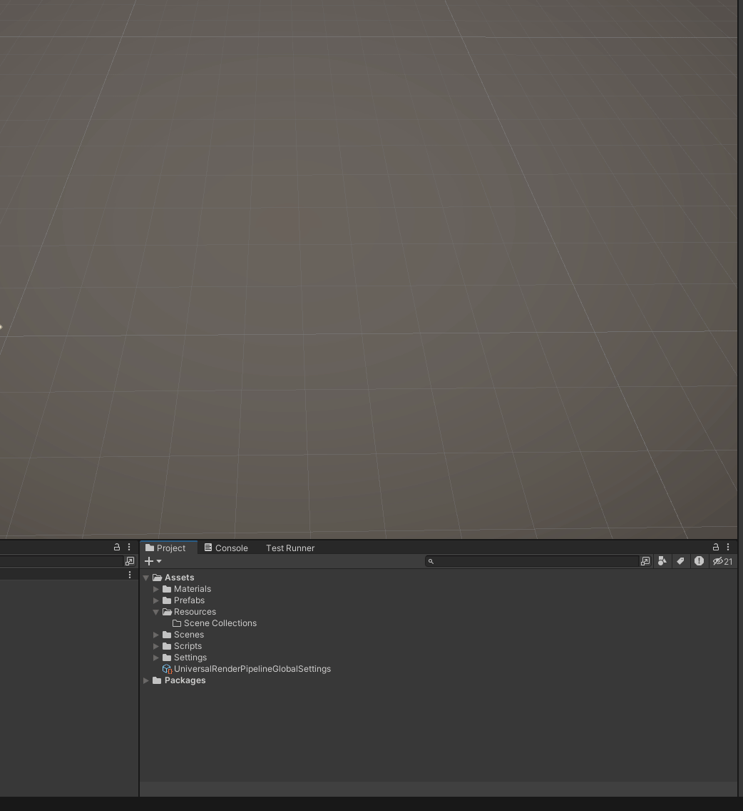
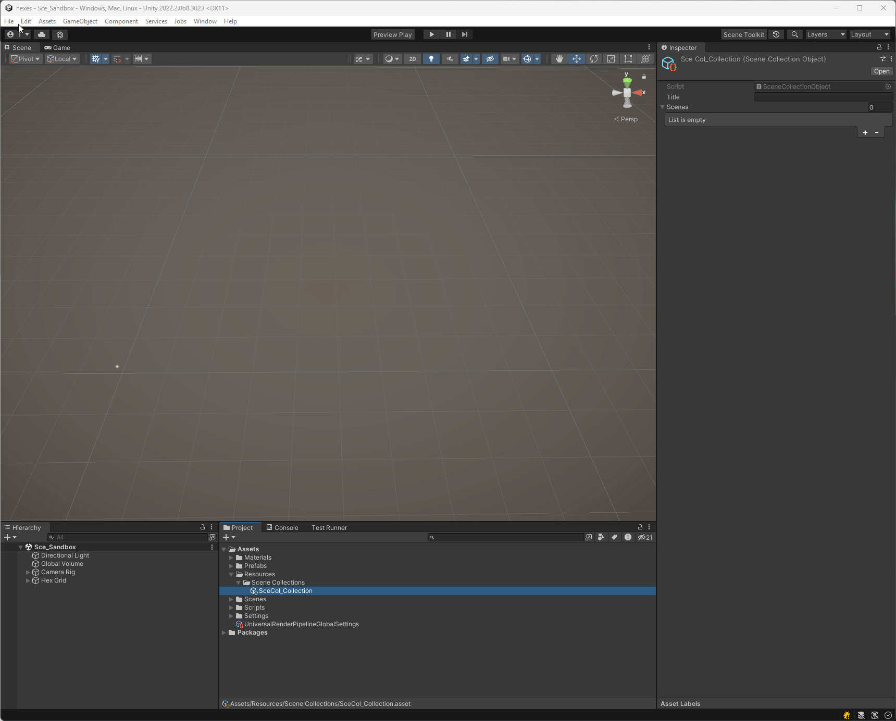
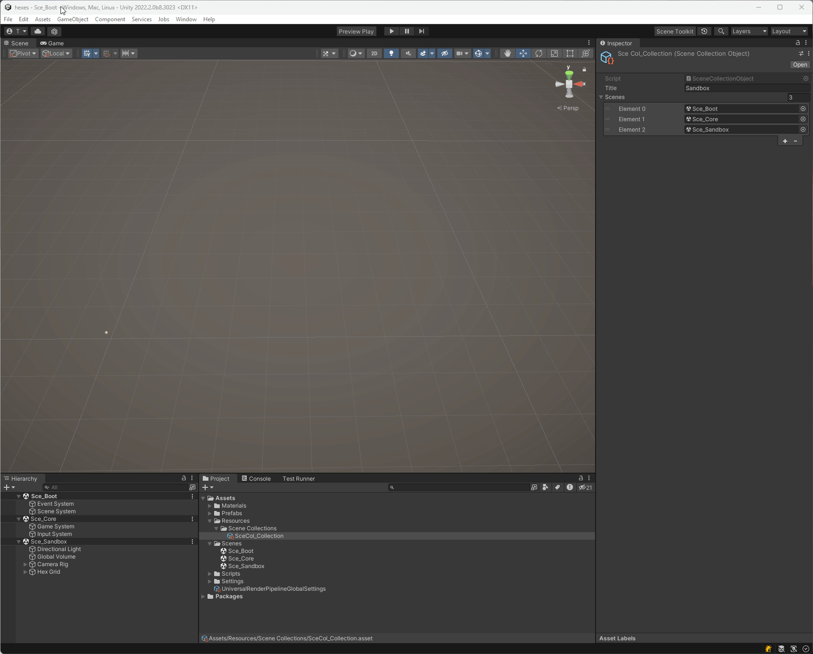

# Scene Toolkit

Adds two tools I often use when working with multiple scenes, heavily inspired by GameDevGuide's videos on multi-scene workflow.

NOTE: It's a hacky WIP currently, but it works.

## Installation
Open Package Manager, click Add Git URL and paste this:
`https://github.com/galkowskit/codes.tkg.scenetoolkit.git`.

## Scene Collections
Create a Scene Collection scriptable object under Create->Scene Toolkit. You can bundle your collections and load them in together with a single click. Scene Collections currently have to live under `Resources/Scene Collections` folder.

## Preview Play
You can use the new button alongside the Play button to run the game from the scene marked as 0 in your Build Settings. This means that you can start your game "from start" with a single click, it should reload previous set of scenes on exit.

